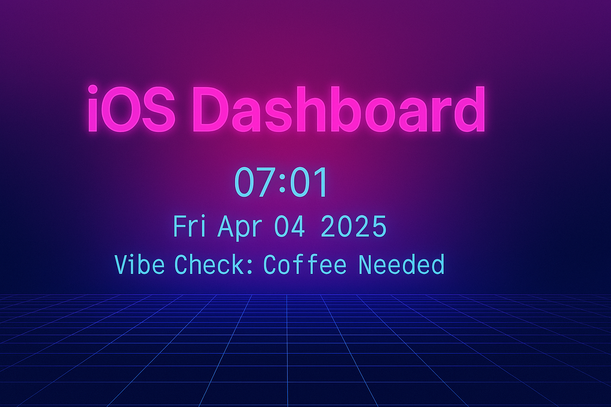

# iOS Dashboard

---

A fully custom, home screen–ready **web dashboard for iPhone** — built and deployed entirely from an iPhone.  
No Mac. No laptop. Just raw mobile dev energy.

### Features
- **Live Time & Date** – auto-updating every second  
- **"Vibe Check"** – dynamic status based on time of day  
- **Quick Links** – jump to GitHub, Shortcuts, Notes, etc  
- **Offline-Ready** – no backend, no tracking  
- **Responsive UI** – built for iPhone but works anywhere

### Use Cases
- Replace your browser homepage  
- Add it to your home screen like an app  
- Customize it to show weather, quotes, todos, or anything else  
- Keep your own private digital command center

### Tech Stack
- HTML  
- CSS  
- Vanilla JavaScript  
- GitHub Pages for hosting

---

### Getting Started

1. Clone or fork this repo  
2. Customize `index.html`, `style.css`, and `script.js`  
3. Enable GitHub Pages (Settings → Pages → source: `/ (root)`)  
4. Visit `https://yourusername.github.io/iOS-dashboard`  
5. Add it to your iPhone home screen via Safari → Share → "Add to Home Screen"

---

### Screenshot

*(Upload your screenshot or generated banner to `assets/banner.png` and it will appear at the top.)*

---

### License

MIT — feel free to copy, customize, and remix.
